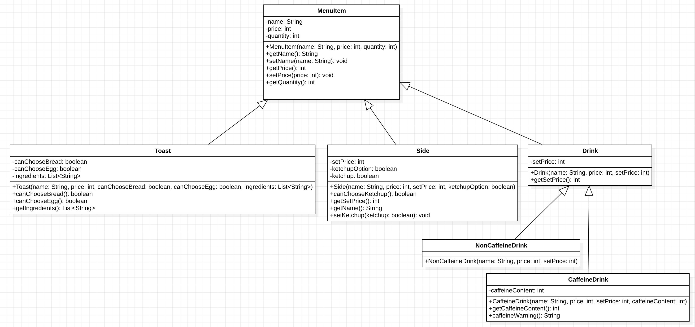

# 이삭토스트 키오스크

이삭토스트 키오스크 CLI 프로그램입니다.

<div align="center">
    
</div>

## 프로젝트 구조
```
src
└── main
    └── java
        └── com
            └── kiosk
                ├── Main.java
                ├── menu
                │   ├── drink
                │   │   ├── CaffeineDrink.java
                │   │   ├── Drink.java
                │   │   └── NonCaffeineDrink.java
                │   ├── side
                │   │   └── Side.java
                │   ├── toast
                │   │   └── Toast.java
                │   └── MenuItem.java
                ├── order
                │   ├── DrinkOrderProcessor.java
                │   ├── InputHandler.java
                │   ├── Menu.java
                │   ├── MenuDisplayer.java
                │   ├── Order.java
                │   ├── PaymentProcessor.java
                │   ├── SetOrderProcessor.java
                │   ├── SideOptionSelector.java
                │   ├── SideOrderProcessor.java
                │   ├── ToastOptionSelector.java
                │   └── ToastOrderProcessor.java
                ├── thread
                │   ├── DisplayBoardThread.java
                │   └── OrderPreparationThread.java
                └── util
                    └── Constants.java

```

### 디렉토리 설명

- **src/main/java/com/kiosk/**: 프로젝트의 주 패키지 디렉토리입니다.
    - `Main.java`: 프로그램의 진입점입니다.
    - **menu/**: 메뉴 관련 클래스들이 위치하는 디렉토리입니다.
        - **drink/**: 음료 관련 클래스들이 위치하는 디렉토리입니다.
            - `CaffeineDrink.java`: 카페인이 포함된 음료를 나타내는 클래스입니다.
            - `Drink.java`: 음료의 기본 클래스입니다.
            - `NonCaffeineDrink.java`: 카페인이 포함되지 않은 음료를 나타내는 클래스입니다.
        - **side/**: 사이드 메뉴 관련 클래스들이 위치하는 디렉토리입니다.
            - `Side.java`: 사이드 메뉴를 나타내는 클래스입니다.
        - **toast/**: 토스트 메뉴 관련 클래스들이 위치하는 디렉토리입니다.
            - `Toast.java`: 토스트 메뉴를 나타내는 클래스입니다.
        - `MenuItem.java`: 메뉴 아이템을 나타내는 클래스입니다.
    - **order/**: 주문 처리 관련 클래스들이 위치하는 디렉토리입니다.
        - `DrinkOrderProcessor.java`: 음료 주문을 처리하는 클래스입니다.
        - `InputHandler.java`: 입력을 처리하는 클래스입니다.
        - `Menu.java`: 메뉴 관련 클래스입니다.
        - `MenuDisplayer.java`: 메뉴를 표시하는 클래스입니다.
        - `Order.java`: 주문 정보를 나타내는 클래스입니다.
        - `PaymentProcessor.java`: 결제 처리를 담당하는 클래스입니다.
        - `SetOrderProcessor.java`: 세트 주문을 처리하는 클래스입니다.
        - `SideOptionSelector.java`: 사이드 옵션을 선택하는 클래스입니다.
        - `SideOrderProcessor.java`: 사이드 주문을 처리하는 클래스입니다.
        - `ToastOptionSelector.java`: 토스트 옵션을 선택하는 클래스입니다.
        - `ToastOrderProcessor.java`: 토스트 주문을 처리하는 클래스입니다.
    - **thread/**: 스레드 관련 클래스들이 위치하는 디렉토리입니다.
        - `DisplayBoardThread.java`: 전광판에 준비 완료된 메뉴 번호를 표시하는 스레드 클래스입니다.
        - `OrderPreparationThread.java`: 주문 번호 발급 후 준비가 완료될 때까지 대기하는 스레드 클래스입니다.
    - **util/**: 유틸리티 클래스들이 위치하는 디렉토리입니다.
        - `Constants.java`: 프로젝트 전역에서 사용하는 상수들을 정의한 클래스입니다.

## 동작 방식

사용자는 주문하고 싶은 메뉴와 옵션을 선택한 뒤,

1. 담기 (장바구니에 담고 계속 주문 진행)
2. 주문하기 (이때까지 장바구니에 담긴 메뉴 계산)
3. 취소 (지금 선택한 메뉴를 담지 않음)

중 선택할 수 있다.

- 토스트, 사이드, 음료를 단품으로 주문할 수 있으며 토스트 옵션에서 세트로 바꿀 수 있다.
- 토스트마다 빵 선택 가능 여부, 계란 선택 가능 여부는 달라질 수 있다.
- 사이드마다 케첩 선택 가능 여부는 달라질 수 있다.
- 토스트 메뉴판에서 0번을 선택하면, 각 토스트의 재료를 확인할 수 있다.
- 음료 메뉴판에서 0번을 선택하면, 각 음료의 카페인 함량을 확인할 수 있다.
- 결제의 경우 한 번에 결제, 나눠서 결제 중에 선택할 수 있다.
- 결제가 완료되면 1부터 20까지의 정수 중 랜덤으로 주문 번호가 생성된다.
- 주문 번호의 초만큼 대기하면 메뉴가 준비된다. (ex. 5번 → 5초)

## 상속 관계


## 클래스 별 설명

### menu
| 클래스 명                 | 속성                                                                                                | 메서드                                                                                                                                                                       |
|-----------------------|---------------------------------------------------------------------------------------------------|---------------------------------------------------------------------------------------------------------------------------------------------------------------------------|
| MenuItem.java         | • name: 메뉴명 <br> • price: 가격 <br> • quantity: 수량                                                  | • getName(): 메뉴명 반환<br>• setName(): 메뉴명 설정<br>• getPrice(): 가격 반환<br>• setPrice(): 가격 설정 <br> • getQuantity(): 수량 반환                                                      |
| Toast.java            | • canChooseBread: 빵 선택이 가능한지<br> • canChooseEgg: 계란 선택이 가능한지<br> • ingredients: 토스트의 재료를 저장하는 리스트 | • canChooseBread(): 빵 선택 가능 여부 반환<br> • canChooseEgg(): 계란 선택 가능 여부 반환<br> • getIngredients(): 재료 반환                                                                      |
| Side.java             | • setPrice: 토스트 세트에서 추가될 사이드 금액<br> • canChooseKetchup: 케첩 선택이 가능한지<br> • ketchup: 케첩 여부          | • canChooseKetchup(): 케첩 선택 가눙 여부 반환<br> • getSetPrice(): 토스트 세트에서 추가될 사이드 금액 반환<br> • getName(): 사이드 메뉴명 반환 (케첩을 선택하지 않은 경우 (케첩 X)라고 표기)<br> • setKetchup(): 케첩 선택 여부 설정 |
| Drink.java            | • setPrice: 토스트 세트에서 추가될 음료 금액                                                                    | • getSetPrice(): 토스트 세트에서 추가될 음료 금액 반환                                                                                                                                    |
| CaffeineDrink.java    | • caffeineContent: 카페인 함량(mg) | • getCaffeineContent(): 카페인 함량 반환 <br>• caffeineWarning(): 고카페인 함량 시 경고 문구 반환                                                                                             
| NonCaffeineDrink.java |

### order
| 클래스 명                    |메서드|
|--------------------------|---|
| DrinkOrderProcessor.java |processDrinkOrder(): 음료를 선택하는 메서드<br>processOrder(): 음료 주문을 처리하는 메서드|
| InputHandler.java        |getIntInput(): 정수를 입력받는 메서드 <br> getBooleanInput(): 옵션 선택을 입력받는 메서드 <br> getQuantity(): 수량을 입력받는 메서드|
| Menu.java                |addItemToCart(): 장바구니에 항목을 추가하는 메서드 <br> showReceipt(): 영수증을 보여주는 메서드 <br> handleOrderOptions(): 메뉴 담기 옵션을 선택받는 메서드 <br> getTotalPrice(): 총 금액을 반환하는 메서드|
| MenuDisplayer.java       |showMainMenu(): 메인 메뉴(카테고리)를 보여주는 메서드 <br> showToastMenu(): 토스트 메뉴를 보여주는 메서드 <br> showSideMenu(): 사이드 메뉴를 보여주는 메서드 <br> showDrinkMenu(): 음료 메뉴를 보여주는 메서드 <br> showToastIngredients(): 토스트 재료를 보여주는 메서드 <br> showDrinkCaffeine(): 음료 카페인 함량을 보여주는 메서드 <br> printMenu(): 메뉴판 출력 메서드 <br> getToasts(): 토스트 메뉴 반환 메서드 <br> getSides(): 사이드 메뉴 반환 메서드 <br> getDrinks(): 음료 메뉴 반환 메서드|
| Order.java               |start(): 주문 프로세스 시작 메서드 <br> greeting(): 인사말 출력 메서드 <br> getUserInput(): 주문 여부를 입력받는 메서드 <br> showMenu(): 메뉴를 보여주는 메서드|
|PaymentProcessor.java|processPayment(): 결제 처리를 담당하는 메서드|
|SetOrderProcessor.java|processSetOrder(): 토스트 세트 주문을 처리하는 메서드|
|SideOptionSelector.java|selectSideOptions(): 사이드 옵션을 선택하는 메서드|
|SideOrderProcessor.java|processSideOrder(): 사이드를 선택하는 메서드 <br> processOrder(): 사이드 주문을 처리하는 메서드|
|ToastOptionSelector.java|selectToastOptions(): 토스트 옵션을 선택하는 메서드|
|ToastOrderProcessor.java|processToastOrder(): 토스트를 선택하는 메서드 <br> processOrder(): 토스트 주문을 처리하는 메서드 <br> selectToastOption(): 토스트 옵션(단품/세트)을 선택하는 메서드|

### thread
| 클래스 명                    | 속성 | 메서드    |
|--------------------------|----|--------|
|OrderPreparationThread.java|orderNumber: 주문 번호|run(): 주문 번호에 해당하는 시간(초)만큼 대기한 후, 준비 완료 메시지를 출력하는 메서드 <br> generateOrderNumber(): 1부터 20까지의 랜덤한 주문 번호를 생성하는 메서드
|DisplayBoardThread.java|isOrderReady: 주문 준비 완료 여부를 나타내는 상태 변수 <br> maxOrderNumber: 최대 주문 번호|run(): 1초마다 숫자를 증가시켜 "준비 완료: X번" 메시지를 같은 줄에 출력하는 메서드 <br> setOrderReady(): 주문 준비 완료 상태를 설정하는 메서드|

### 스레드 간 상호작용 과정 설명

- OrderPreparationThread 실행 방식
    - 주문 번호의 시간(초)만큼 대기한다.
    - 대기 시간이 끝나면, displayBoardThread.setOrderReady() 를 호출하여 isOrderReady를 true로 설정한다.
- DisplayBoardThread 실행 방식
    - run()에서 isOrderReady 변수를 지속적으로 검사한다.
    - isOrderReady가 false인 경우 1초마다 "준비 완료: X번" 메시지를 출력하며 숫자를 증가시킨다.
- 상호작용 방식
    - OrderPreparationThread가 isOrderReady를 true로 설정하면, DisplayBoardThread의 while 루프 조건이 false가 되어 루프를 종료한다.

## 시연 영상
